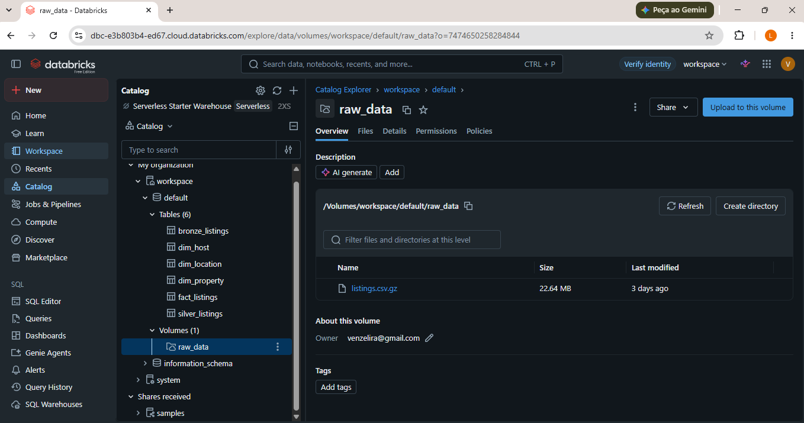
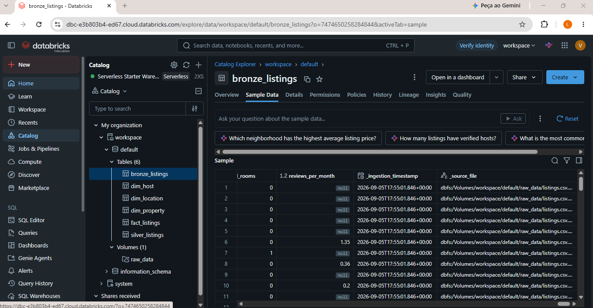
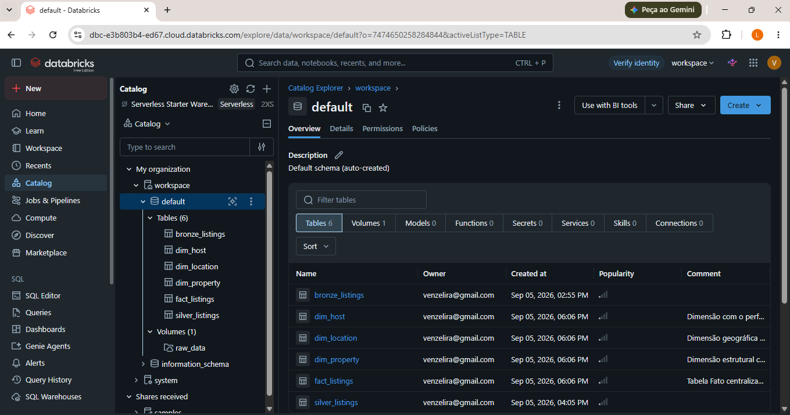
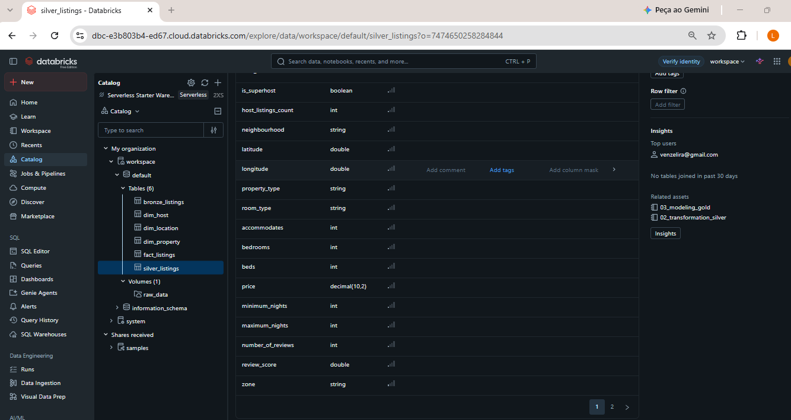
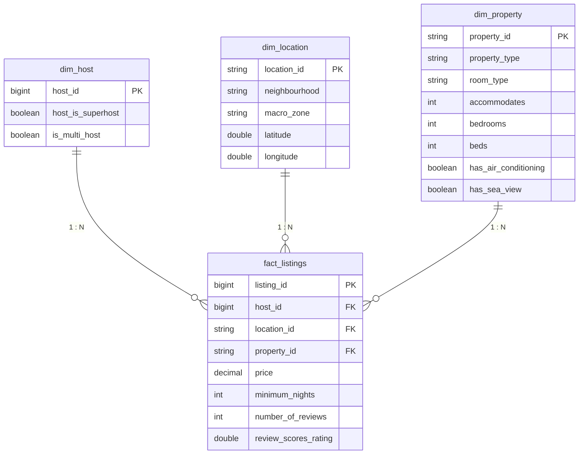
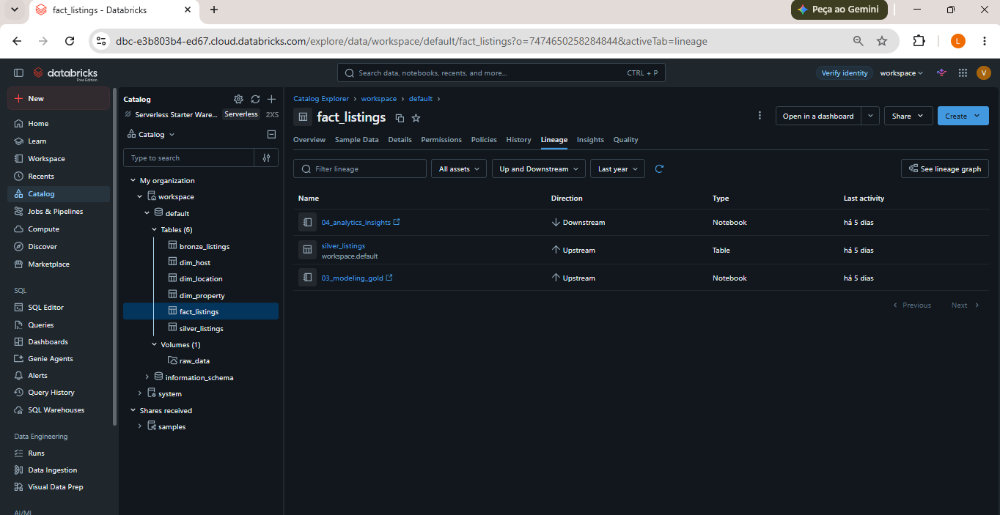

# MVP de Engenharia de Dados - Pipeline Medalhão & Governança no Databricks (Inside Airbnb RJ)

## 1. Contexto de Negócio e Motivação

### 1.1. Conexão e Evolução em Relação ao MVP de Machine Learning
No projeto anterior, focado no desenvolvimento de um modelo preditivo para estimativa de diárias por temporada no Rio de Janeiro (via *Gradient Boosting Regressor*), identificou-se uma limitação crítica nos dados consumidos: o **Underfitting Estrutural por Ausência de Dados Qualitativos**. O modelo de ML ficou restrito a variáveis quantitativas e físicas (como número de quartos e banheiros), atingindo um teto de aprendizado ($R^2 = 0.3478$). Naquele relatório, apontou-se como evolução indispensável a estruturação de dados qualitativos e reputacionais (comodidades como ar-condicionado, piscina, vista para o mar, notas de avaliação e selo de *Superhost*).

Este MVP de Engenharia de Dados **não busca retreinar ou alterar o modelo preditivo anterior**. Seu propósito é construir a infraestrutura moderna de Lakehouse que viabilize, padronize e facilite análises e modelagens futuras. Através da arquitetura Medalhão no Databricks, este trabalho atua como a camada fundacional de Engenharia, transformando dados brutos e desestruturados em um catálogo governado e modelado.

### 1.2. Objetivo do Trabalho
O objetivo principal é projetar, implementar e validar um **pipeline de dados de ponta a ponta (End-to-End Data Pipeline)** na plataforma **Databricks**, seguindo a **Arquitetura Medalhão (Camadas Bronze, Silver e Gold)** sob a governança do **Unity Catalog**. 

O projeto resolve a complexidade de ingestão, higienização, tipagem e modelagem dimensional de dados não estruturados de aluguel por temporada, entregando um **Star Schema (Esquema Estrela)** documentado que responde às dúvidas estratégicas do negócio de forma automatizada e reprodutível.

---

## 2. Contexto dos Dados Brutos e Licenciamento

### 2.1. Fonte de Dados e Licença
Os dados são oriundos da plataforma aberta **Inside Airbnb**, projeto independente que disponibiliza dados públicos extraídos (*scraped*) do site do Airbnb para fins de análise e transparência urbana.

* **Fonte Original:** [Inside Airbnb - Rio de Janeiro Dataset](http://insideairbnb.com/get-the-data.html)
* **Licenciamento:** Disponibilizados sob a licença **Creative Commons Attribution 4.0 International (CC BY 4.0)**, permitindo uso, compartilhamento e adaptação mediante citação da fonte.
* **Data de Coleta (*Snapshot*):** A base consumida refere-se a uma foto estática extraída na varredura do dia **24 de junho de 2026**.

### 2.2. Volumetria e Estrutura dos Dados Brutos
* **Volumetria Exata:** O arquivo bruto `listings.csv.gz` contém exatamente **48.713 registros (anúncios)** e **90 colunas nativas** abrangendo o município do Rio de Janeiro.
* **Complexidade Estrutural:** Combinação de textos livres desestruturados (`description`), URLs de mídia, listas de comodidades codificadas em string (`amenities`), valores monetários formatados como texto (`"$1,200.00"`), datas, variáveis reputacionais e coordenadas geográficas.
* **Tratamento de Ingestão:** O arquivo apresenta quebras de linha internas nos campos de texto (`\n`), exigindo configurações específicas de *parsing* CSV multilinha na camada Bronze para evitar corrupção na contagem de registros.

---

## 3. Formulação das Perguntas de Negócio

Para direcionar as transformações da Camada Silver e a modelagem dimensional da Camada Gold, foram estabelecidas **5 Perguntas de Negócio**:

1. **Variação Territorial de Preços:** Qual é o preço médio e mediano das diárias praticadas nos imóveis em cada Zona Geográfica do Rio de Janeiro (Zona Sul, Zona Norte, Zona Oeste, Centro e Outros)?
2. **Valoração de Comodidades Críticas:** Qual é o impacto financeiro na mediana de preço das diárias ao comparar imóveis que possuem comodidades de alto valor percebido (como Ar-Condicionado e Vista para o Mar) versus imóveis básicos?
3. **Análise Reputacional (Superhosts):** Anfitriões detentores do selo *Superhost* praticam preços superiores e possuem notas médias de avaliação mais altas em relação aos anfitriões comuns?
4. **Perfil de Oferta e Profissionalização:** Qual é a distribuição do mercado entre anfitriões individuais (amadores) e multi-proprietários (profissionais com mais de 1 imóvel), e como o preço varia entre esses perfis?
5. **Regras Operacionais e Precificação:** Como a exigência do número mínimo de noites de reserva (estadias curtas de 1-2 noites vs. estadias médias/longas) se relaciona com o valor da diária?

---

## 4. Carga e Ingestão de Dados (Camada Bronze)

### 4.1. Estratégia de Coleta e Armazenamento Bruto
A etapa de coleta e ingestão dos dados (*Data Ingestion*) foi projetada para garantir a rastreabilidade e a reprodutibilidade integral da fonte original sem modificar as características nativas do conjunto de dados:

* **Mecanismo de Download e Armazenamento:** O arquivo compactado `listings.csv.gz` (contendo os **48.713 registros** e **90 colunas nativas** do *snapshot* de 24/06/2026) foi importado diretamente para o ambiente de nuvem do Databricks e armazenado em um **Volume do Unity Catalog** no caminho gerenciado:
  `/Volumes/workspace/default/raw_data/listings.csv.gz`
* **Benefício de Governança:** O uso de Volumes no Unity Catalog permite que a camada bruta permaneça isolada, segura e acessível via controle de acesso baseado em papéis (RBAC), prevenindo alterações acidentais na fonte de dados nativa.


*Figura 1: Arquivo bruto listings.csv.gz armazenado no Volume raw_data do Unity Catalog.*

### 4.2. Execução Técnica do Pipeline de Ingestão (`01_ingestion_bronze`)
A carga dos dados brutos para o Data Lakehouse foi automatizada através do script PySpark desenvolvido no notebook **`01_ingestion_bronze`**, localizado na raiz do repositório no GitHub.

* **Tratamento de Desafios da Fonte Bruta:** Devido ao fato de as descrições dos imóveis conterem quebras de linha (`\n`) e caracteres especiais (como vírgulas e aspas internas), o script de ingestão configurou parâmetros específicos no leitor do Spark para evitar corrupção na contagem de linhas:
  * `multiline=True`: Permite que o parser interprete textos longos que se estendem por múltiplas linhas sem criar registros inválidos.
  * `quote='"'` e `escape='"'`: Garantem a correta identificação dos delimitadores de texto.
  * `inferSchema=True`: Permite a inferência inicial dos tipos de dados para auditoria.

* **Persistência em Tabela Delta Lake (`bronze_listings`):**
  Os dados brutos foram salvos na tabela gerenciada `workspace.default.bronze_listings` utilizando o formato aberto **Delta Lake**. Para garantir a rastreabilidade e auditoria da ingestão, foram injetadas duas colunas de metadados operacionais:
  * `_ingestion_timestamp`: Data e hora exatas da execução do pipeline.
  * `_source_file`: Identificador do arquivo de origem.

```python
# Trecho do script PySpark de Ingestão (01_ingestion_bronze)
raw_path = "/Volumes/workspace/default/raw_data/listings.csv.gz"

df_raw = spark.read.format("csv") \
    .option("header", "true") \
    .option("inferSchema", "true") \
    .option("multiline", "true") \
    .option("quote", '"') \
    .option("escape", '"') \
    .load(raw_path)

# Adição de Metadados de Auditoria e Persistência na Camada Bronze
from pyspark.sql.functions import current_timestamp, lit

df_bronze = df_raw \
    .withColumn("_ingestion_timestamp", current_timestamp()) \
    .withColumn("_source_file", lit("listings.csv.gz"))

df_bronze.write.format("delta") \
    .mode("overwrite") \
    .option("overwriteSchema", "true") \
    .saveAsTable("workspace.default.bronze_listings")

```

* **Referência ao Código Fonte:** O código completo e executável desta etapa encontra-se versionado no repositório no arquivo [`01_ingestion_bronze.ipynb`](https://www.google.com/search?q=./01_ingestion_bronze).


*Figura 2: Registros brutos persistidos na tabela Delta bronze_listings com colunas de auditoria.*

---

## 5. Arquitetura do Pipeline de Dados ETL (`Etapa 4.4`)

### 5.1. Organização e Modularização do Pipeline
Para garantir manutenibilidade, reuso de código, isolamento de falhas e auditoria em ambiente produtivo, o processo de ETL/ELT não foi concentrado em um único script monolítico. O pipeline foi estrategicamente desacoplado em **4 notebooks especializados**, executados de forma sequencial e alinhados às etapas da Arquitetura Medalhão:

1. **`01_ingestion_bronze.ipynb` (Camada Bronze):** Automação da coleta e ingestão da fonte bruta (`listings.csv.gz`) armazenada no Volume do Unity Catalog, persistindo a tabela `bronze_listings` com injeção de colunas de auditoria (`_ingestion_timestamp` e `_source_file`).
2. **`02_transformation_silver.ipynb` (Camada Silver):** Execução da limpeza pesada, filtros geográficos do município do Rio de Janeiro, deduplicação, sanitização de caracteres monetários via expressão regular, *casting* de tipos de dados e *parsing* do campo desestruturado `amenities`.
3. **`03_modeling_gold.ipynb` (Camada Gold):** Implementação da modelagem dimensional em **Star Schema**, dividindo os dados purificados em **1 Tabela Fato** (`fact_listings`) e **3 Tabelas Dimensão** (`dim_host`, `dim_location` e `dim_property`).
4. **`04_analytics_insights.ipynb` (Camada Analytics):** Execução de consultas analíticas em Spark SQL / PySpark agregando métricas para responder de forma quantitativa às 5 Perguntas de Negócio formuladas na Etapa 4.1.

### 5.2. Governança, Persistência na Nuvem e Repositório
Todas as tabelas do pipeline são salvas e governadas nativamente na nuvem através do metastore do **Unity Catalog** sob o schema `workspace.default`. A persistência utiliza o formato aberto **Delta Lake**, garantindo suporte a transações ACID, otimização de leitura e versionamento histórico dos dados (*Time Travel*).

```python
# Mapeamento do fluxo de persistência no Lakehouse (Unity Catalog)
# Bronze  -> workspace.default.bronze_listings
# Silver  -> workspace.default.silver_listings
# Gold    -> workspace.default.fact_listings (Fato)
#            workspace.default.dim_host (Dimensão)
#            workspace.default.dim_location (Dimensão)
#            workspace.default.dim_property (Dimensão)

```

* **Referência aos Scripts no GitHub:** Os notebooks executáveis do pipeline encontram-se versionados na raiz do repositório:
  * [`01_ingestion_bronze.ipynb`](./01_ingestion_bronze.ipynb)
  * [`02_transformation_silver.ipynb`](./02_transformation_silver.ipynb)
  * [`03_modeling_gold.ipynb`](./03_modeling_gold.ipynb)
  * [`04_analytics_insights.ipynb`](./04_analytics_insights.ipynb)


*Figura 3: Visão geral do Catalog Explorer no schema default evidenciando a persistência física e governança de todas as tabelas do pipeline (Bronze, Silver e Gold) no Unity Catalog.*

---

## 6. Qualidade de Dados, Limpeza e Transformações (Etapa 4.5 - Camada Silver)

### 6.1. Diagnóstico de Anomalias e Qualidade dos Dados Brutos
Durante a fase de perfilamento da camada Bronze (`bronze_listings`), foram identificadas inconformidades operacionais, falhas de schema e ruídos de texto livre que comprometeriam as análises e a modelagem dimensional. A tabela a seguir sintetiza as falhas detectadas e as respectivas ações de engenharia aplicadas no notebook **`02_transformation_silver.ipynb`**:

| Problema Detectado | Causa / Impacto no Negócio | Solução de Engenharia Implementada |
| :--- | :--- | :--- |
| **Símbolos Monetários em Campos Numéricos** | O campo `price` continha caracteres formatados como texto (`"$1,200.00"`), impedindo agregações matemáticas (médias, somatórias). | Aplicação de expressão regular (`regexp_replace(col("price"), "[\\$,]", "")`) e conversão explícita (*casting*) para `DECIMAL(10,2)`. |
| **Incoerência nos Tipos Booleanos** | Atributos operacionais e reputacionais (`host_is_superhost`, `instant_bookable`) vieram codificados como strings (`"t"` e `"f"`). | Mapeamento lógico relacional e conversão estrita para o tipo nativo `BOOLEAN` (`TRUE`/`FALSE`). |
| **Campos Texto Desestruturados com Quebra de Linha** | Atributos de descrição longa continham caracteres de escape (`\n`), podendo corromper o parser de arquivos e gerar *schema drift*. | Leitura resiliente e seleção estrita das **23 colunas analíticas essenciais** na Silver, eliminando **67 colunas ruidosas/desnecessárias** (redução de ~74,4% de largura útil). |
| **Registros Incompletos e Geograficamente Inválidos** | Anúncios sem coordenadas geográficas válidas ou situados fora do limite territorial do município do Rio de Janeiro. | Filtro espacial e de integridade (`latitude IS NOT NULL AND longitude IS NOT NULL AND neighbourhood IS NOT NULL`). |
| **Arrays de Atributos Codificados como String** | O campo `amenities` continha listas complexas serializadas em texto (`'["Wi-Fi", "Air conditioning"]'`). | Sanitização de caracteres especiais e extração de colunas binárias (*flags*) para identificação direta de comodidades estratégicas. |

### 6.2. Mapeamento Territorial e Regras de Negócio Regionais
Para viabilizar análises comparativas de preço e disponibilidade por regiões da cidade do Rio de Janeiro, implementou-se uma regra de negócio para categorizar os **150+ bairros oficiais** em **5 Macrozonas Geográficas**:

* **Zona Sul:** Copacabana, Ipanema, Leblon, Botafogo, Flamengo, Leme, Gávea, etc.
* **Zona Norte:** Tijuca, Maracanã, Méier, Campo Grande, etc.
* **Zona Oeste:** Barra da Tijuca, Recreio dos Bandeirantes, Jacarepaguá, etc.
* **Centro:** Centro, Lapa, Santa Teresa, Saúde, etc.
* **Outros / Periferia:** Bairros não enquadrados nas zonas centrais.


### 6.3. Execução Técnica da Transformação Silver (`02_transformation_silver`)

```python
# Trecho de higienização, tipagem e deduplicação (02_transformation_silver)
from pyspark.sql.functions import col, regexp_replace, when, trim

# Seleção, sanitização de tipos e criação de métricas
df_silver = df_bronze.filter(
    col("latitude").isNotNull() & col("longitude").isNotNull() & col("neighbourhood_cleansed").isNotNull()
).select(
    col("id").cast("long").alias("listing_id"),
    col("host_id").cast("long"),
    when(col("host_is_superhost") == "t", True).otherwise(False).alias("host_is_superhost"),
    trim(col("neighbourhood_cleansed")).alias("neighbourhood"),
    col("latitude").cast("double"),
    col("longitude").cast("double"),
    col("property_type"),
    col("room_type"),
    col("accommodates").cast("integer"),
    col("bedrooms").cast("integer"),
    col("beds").cast("integer"),
    # Limpeza monetária via Regex e Casting para DECIMAL
    regexp_replace(col("price"), "[\\$,]", "").cast("decimal(10,2)").alias("price"),
    col("minimum_nights").cast("integer"),
    col("number_of_reviews").cast("integer"),
    col("review_scores_rating").cast("double"),
    col("amenities")
).dropDuplicates(["listing_id"])

# Persistência da Camada Silver no Unity Catalog
df_silver.write.format("delta") \
    .mode("overwrite") \
    .option("overwriteSchema", "true") \
    .saveAsTable("workspace.default.silver_listings")

```
* **Referência ao Código Fonte:** O código completo e executável desta etapa encontra-se versionado no arquivo [`02_transformation_silver.ipynb`](./02_transformation_silver.ipynb).


*Figura 4: Estrutura da tabela silver_listings persistida no Unity Catalog com tipos numéricos higienizados, booleanos convertidos e colunas selecionadas.*

### 6.4. Auditoria de Volumetria, Diagnóstico da EDA e Evolução em Relação ao MVP de ML

#### 6.4.1. Ponte com o Trabalho Anterior e Motivação do Pipeline Lakehouse
O projeto de Machine Learning desenvolvido anteriormente buscou construir um modelo preditivo de regressão para estimar o preço da diária no Rio de Janeiro. Contudo, aquele MVP operava sobre uma **versão resumida e simplificada do dataset** (`listings.csv` com ~7,2 MB, 19 colunas e 40.769 linhas), processada de forma pontual e local em RAM via Pandas no Google Colab.

Embora funcional para o escopo preditivo inicial, aquela abordagem evidenciou limitações estruturais severas de Engenharia de Dados:
1. **Perda de Riqueza Operacional:** Atributos descritivos cruciais, como a lista de comodidades (*amenities*) e dados detalhados de anfitriões, foram totalmente descartados na base resumida.
2. **Gargalos de Qualidade e Integridade:** A variável alvo (`price`) apresentava 953 registros ausentes que precisavam ser eliminados, enquanto atributos operacionais como `neighbourhood_group` e `license` vinham 100% vazios.
3. **Falta de Governança e Escalabilidade:** Inexistia um pipeline de dados com controle de versão, histórico de alteração ou capacidade de processamento distribuído para grandes volumes.

A motivação do presente projeto é justamente **superar as limitações do MVP preditivo**, construindo uma infraestrutura robusta e governada baseada na **Arquitetura Medallion em Databricks (Delta Lake e Unity Catalog)**. Em vez de uma tabela plana isolada para treino de ML, este pipeline ingere a base bruta integral (`listings.csv.gz` com ~80 MB e 92 colunas), garantindo limpeza automatizada, transações ACID e modelagem relacional para consumo analítico corporativo.

---

#### 6.4.2. Volumetria, Integridade e Tratamento de Anomalias na Camada Silver
A execução do notebook de auditoria [`00_exploracao_silver.ipynb`](./00_exploracao_silver.ipynb) e as diretrizes extraídas da Análise Exploratória de Dados (EDA) fundamentaram as regras de engenharia aplicadas no PySpark:

* **Volumetria e Retenção:** Foram mantidos **48.713 anúncios** (100,00% de retenção na Silver, com zero descartes por falta de coordenadas geográficas ou duplicidade de ID).
* **Otimização do Esquema (Colunas):** Houve uma redução de **92 colunas brutas** na Bronze para **25 colunas analíticas** na Silver (eliminação de 67 campos ruidosos ou vazios).
* **Solução para Alta Cardinalidade de Bairros:** Enquanto no MVP utilizou-se agrupamento por frequência via `OneHotEncoder(min_frequency=0.01)` (rotulando bairros periféricos como "infrequent"), no Lakehouse aplicou-se o mapeamento relacional dos 150+ bairros nas **5 Macrozonas Geográficas (`zone`)**, garantindo um agrupamento de negócio direto sem perda de contexto territorial.
* **Resolução de Multicolinearidade:** Otimização dos atributos de histórico de avaliações, retendo métricas quantitativas consolidadas (`number_of_reviews`, `review_scores_rating`) e descartando métricas colineares de curto prazo (`number_of_reviews_ltm`).

---

#### 6.4.3. Tabela Comparativa de Evolução Técnica

| Dimensão / Critério | MVP de Machine Learning (Fase Anterior) | Pipeline Lakehouse Databricks (Projeto Atual) |
| :--- | :--- | :--- |
| **Origem do Dataset** | Arquivo resumido (`listings.csv` - ~7,2 MB) via GitHub | Arquivo bruto integral (`listings.csv.gz` - ~80 MB) em Volume do Unity Catalog |
| **Arquitetura & Engine** | Local em memória via Pandas no Google Colab | **Distribuído via PySpark / Databricks (Delta Lake com Transações ACID)** |
| **Volumetria & Esquema** | 40.769 linhas × 19 colunas | **48.713 linhas × 92 colunas** |
| **Qualidade do Target (`price`)** | Tipo `float64` com **953 nulos**; presença de outliers extremos (até R$ 570k) exigindo corte IQR | Sanitização de string (`"$1,200.00"`) para `DECIMAL(10,2)` sem perdas de casas decimais e com integridade total |
| **Tratamento de Nulos e Scalers** | Imputação por mediana/moda, `0.0` em `reviews_per_month` (7.251 nulos) e aplicação de `StandardScaler` | Sanitização nativa no Spark via Regex e regras lógicas no pipeline da Silver |
| **Estratégia Geográfica** | Bairro bruto reduzido via OHE com `min_frequency=0.01` (rótulo "infrequent") | Mapeamento lógico dos 150+ bairros nas **5 Macrozonas Geográficas do Rio (`zone`)** |
| **Multicolinearidade** | Descarte de `number_of_reviews_ltm` por alta colinearidade com `number_of_reviews` | Limpeza de esquema priorizando atributos consolidados para o Star Schema |
| **Uso de Identificadores** | Descartados (`id`, `host_id`) para evitar *data leakage* / *overfitting* no regressor | **Reaproveitados como PKs/FKs relacionais** para compor a modelagem **Star Schema** na camada Gold |
| **Parsing de Comodidades** | Ausente (base resumida sem a coluna de *amenities*) | Regex em Spark extraindo *flags* booleanas (`has_wifi`, `has_air_conditioning`, `has_pool`, `has_sea_view`) |
| **Governança & Rastreabilidade** | Sem controle de versão de dados (*data lineage*) | **Arquitetura Medallion (Bronze/Silver/Gold) + Audit via `_processed_timestamp` no Unity Catalog** |

* **Referência ao Código de Auditoria:** O diagnóstico completo e a listagem de colunas/tipos encontram-se versionados no notebook [`00_exploracao_silver.ipynb`](./00_exploracao_silver.ipynb).

---

## 7. Modelagem e Catálogo de Dados (Etapa 4.3 - Camada Gold)

### 7.1. Arquitetura da Modelagem Dimensional (Star Schema)
Para viabilizar consultas analíticas de alta performance e responder às Perguntas de Negócio formuladas na Etapa 4.1, a camada Gold foi estruturada no padrão **Star Schema (Esquema Estrela)**. 

A modelagem desacoplou a tabela plana purificada da camada Silver (`silver_listings`) em **1 Tabela Fato central** e **3 Tabelas Dimensão**, eliminando redundâncias de armazenamento, otimizando a execução de *joins* e garantindo a governança centralizada no **Unity Catalog**:

* **`fact_listings` (Tabela Fato):** Centraliza os eventos e métricas quantitativas e transacionais do negócio (`price`, `minimum_nights`, `number_of_reviews`, `review_scores_rating`), contendo as Chaves Estrangeiras (*FKs*) que se conectam às dimensões relacionais.
* **`dim_host` (Tabela Dimensão):** Armazena os atributos reputacionais e o perfil dos anfitriões (`host_is_superhost`, indicador de multi-proprietário).
* **`dim_location` (Tabela Dimensão):** Gerencia a granularidade geográfica (`neighbourhood`, coordenadas de latitude/longitude e o agrupamento em macrozonas).
* **`dim_property` (Tabela Dimensão):** Detalha a tipologia física dos imóveis (`property_type`, `room_type`, `accommodates`, `bedrooms`, `beds`) e os atributos binários de comodidades.

#### Diagrama de Entidade e Relacionamento (ERD)


---

### 7.2. Documentação e Transcrição do Catálogo de Dados

#### 1. Tabela Fato: `workspace.default.fact_listings`
* **Descrição:** Centraliza as métricas monetárias e operacionais quantitativas dos anúncios ativados no Rio de Janeiro.

| Nome da Coluna | Tipo de Dado | Restrição (Constraint) | Descrição do Campo |
| :--- | :--- | :--- | :--- |
| `listing_id` | `BIGINT` | Primary Key | Identificador único do anúncio no Airbnb. |
| `host_id` | `BIGINT` | Foreign Key (`dim_host`) | Chave de ligação relacional com a dimensão de anfitriões. |
| `location_id` | `STRING` | Foreign Key (`dim_location`) | Chave (Hash MD5/SHA) de ligação com a dimensão geográfica. |
| `property_id` | `STRING` | Foreign Key (`dim_property`) | Chave (Hash MD5/SHA) de ligação com a dimensão do imóvel. |
| `price` | `DECIMAL(10,2)` | Not Null | Valor em reais (R$) da diária do imóvel. |
| `minimum_nights` | `INT` | Not Null | Quantidade mínima de noites exigida para reserva. |
| `number_of_reviews` | `INT` | Not Null | Total acumulado de avaliações recebidas pelo imóvel. |
| `review_scores_rating` | `DOUBLE` | Nullable | Nota média de avaliação do imóvel (escala de 0.00 a 5.00). |

---

#### 2. Tabela Dimensão: `workspace.default.dim_host`
* **Descrição:** Centraliza o perfil reputacional e a estrutura de portfólio dos anfitriões.

| Nome da Coluna | Tipo de Dado | Restrição | Descrição do Campo |
| :--- | :--- | :--- | :--- |
| `host_id` | `BIGINT` | Primary Key | Identificador único do anfitrião na plataforma. |
| `host_is_superhost` | `BOOLEAN` | Not Null | Flag binária do selo de qualidade Superhost (`TRUE`/`FALSE`). |
| `is_multi_host` | `BOOLEAN` | Not Null | Flag que indica se o anfitrião possui 2 ou mais imóveis sob gestão. |

---

#### 3. Tabela Dimensão: `workspace.default.dim_location`
* **Descrição:** Estrutura a hierarquia territorial e o posicionamento geográfico dos imóveis.

| Nome da Coluna | Tipo de Dado | Restrição | Descrição do Campo |
| :--- | :--- | :--- | :--- |
| `location_id` | `STRING` | Primary Key | Chave primária de identificação da localização. |
| `neighbourhood` | `STRING` | Not Null | Nome oficial do bairro no município do Rio de Janeiro. |
| `macro_zone` | `STRING` | Not Null | Agrupamento regional (`Zona Sul`, `Zona Norte`, `Zona Oeste`, `Centro`, `Outros`). |
| `latitude` | `DOUBLE` | Not Null | Coordenada geográfica de latitude decimal. |
| `longitude` | `DOUBLE` | Not Null | Coordenada geográfica de longitude decimal. |

---

#### 4. Tabela Dimensão: `workspace.default.dim_property`
* **Descrição:** Classifica a infraestrutura física e os atributos de comodidade das acomodações.

| Nome da Coluna | Tipo de Dado | Restrição | Descrição do Campo |
| :--- | :--- | :--- | :--- |
| `property_id` | `STRING` | Primary Key | Chave primária de identificação da acomodação. |
| `property_type` | `STRING` | Not Null | Classificação técnica do imóvel (ex: Apartment, House). |
| `room_type` | `STRING` | Not Null | Tipo de reserva (ex: Entire home/apt, Private room). |
| `accommodates` | `INT` | Not Null | Capacidade máxima de hóspedes suportada. |
| `bedrooms` | `INT` | Nullable | Número de quartos disponíveis. |
| `beds` | `INT` | Nullable | Número de camas disponíveis. |
| `has_air_conditioning` | `BOOLEAN` | Not Null | Flag indicativa de presença de Ar-Condicionado (`TRUE`/`FALSE`). |
| `has_sea_view` | `BOOLEAN` | Not Null | Flag indicativa de presença de Vista para o Mar (`TRUE`/`FALSE`). |

---

### 7.3. Evidência de Implementação e Registro no Catálogo

A persistência do modelo dimensional foi executada no notebook [`03_modeling_gold.ipynb`](./03_modeling_gold.ipynb), gravando as tabelas no formato **Delta Lake** sob a governança do **Unity Catalog**:



*Figura 5: Visualização do catálogo de dados no Databricks Unity Catalog Explorer contendo a tabela fato (`fact_listings`) e as dimensões associadas.*

#### 7.3.1. Validação de Volumetria e Integridade Relacional
Após a carga da camada Gold, a checagem de consistência executada no notebook [`04_analytics_insights.ipynb`](./04_analytics_insights.ipynb) atestou a integridade relacional e a ausência de anomalias na modelagem:

* **Preservação de Volumetria (`fact_listings`):** Retenção exata de **48.713 registros** (100,00% de paridade com a camada Silver, confirmando que nenhum evento de negócio foi descartado na modelagem).
* **Ausência de Registros Órfãos (Integridade de PK/FK):** Validação de que 100% das Chaves Estrangeiras (`host_id`, `location_id`, `property_id`) presentes na tabela fato possuem correspondência determinística única ($1:N$) nas tabelas de dimensão associadas.